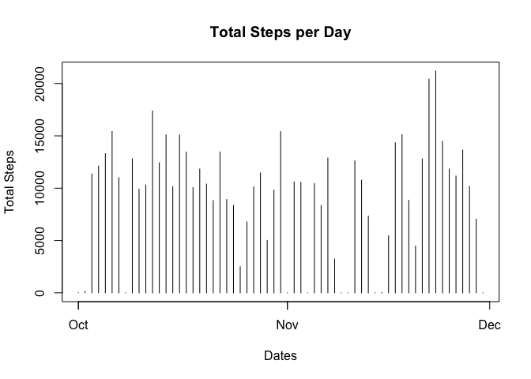
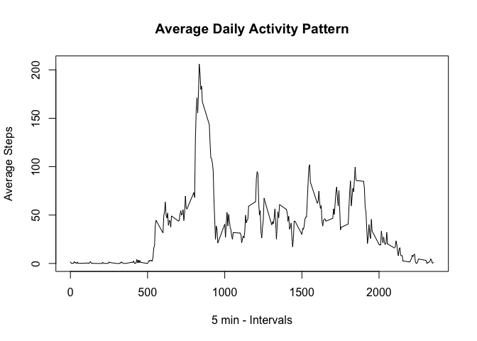
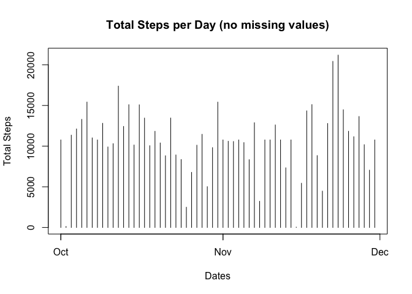
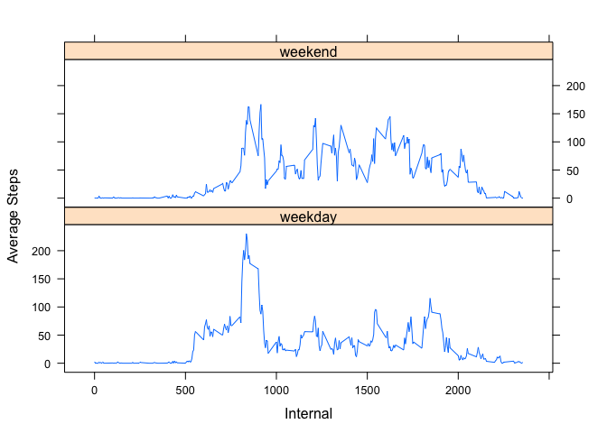

Load libraries..

```r
library(dplyr)
```

```
## 
## Attaching package: 'dplyr'
```

```
## The following objects are masked from 'package:stats':
## 
##     filter, lag
```

```
## The following objects are masked from 'package:base':
## 
##     intersect, setdiff, setequal, union
```

```r
library(ggplot2)
```

```
## Registered S3 methods overwritten by 'ggplot2':
##   method         from 
##   [.quosures     rlang
##   c.quosures     rlang
##   print.quosures rlang
```

## Loading and preprocessing the data
First, we read the CSV into a dataframe

```r
df <- read.csv("activity.csv")
df$date <- as.POSIXct(df$date, format="%Y-%m-%d")
```

Check out the dimensions..

```r
dim(df)
```

```
## [1] 17568     3
```

Preview the data..

```r
head(df,10)
```

```
##    steps       date interval
## 1     NA 2012-10-01        0
## 2     NA 2012-10-01        5
## 3     NA 2012-10-01       10
## 4     NA 2012-10-01       15
## 5     NA 2012-10-01       20
## 6     NA 2012-10-01       25
## 7     NA 2012-10-01       30
## 8     NA 2012-10-01       35
## 9     NA 2012-10-01       40
## 10    NA 2012-10-01       45
```

## What is mean total number of steps taken per day?
Calculate total steps / day

```r
stepsByDay <- df %>%
      group_by(date) %>%
      summarise(total_steps=sum(steps, na.rm=TRUE))

head(stepsByDay)
```

```
## # A tibble: 6 x 2
##   date                total_steps
##   <dttm>                    <int>
## 1 2012-10-01 00:00:00           0
## 2 2012-10-02 00:00:00         126
## 3 2012-10-03 00:00:00       11352
## 4 2012-10-04 00:00:00       12116
## 5 2012-10-05 00:00:00       13294
## 6 2012-10-06 00:00:00       15420
```
Plot on a histogram..

```r
plot(stepsByDay$date, stepsByDay$total_steps, type="h", 
     main="Total Steps per Day", xlab = "Dates", ylab = "Total Steps")
```

<!-- -->

Calculate and report the mean and median of the total number of steps taken per day

```r
mean(stepsByDay$total_steps)
```

```
## [1] 9354.23
```

```r
median(stepsByDay$total_steps)
```

```
## [1] 10395
```

## What is the average daily activity pattern?

Grouping the data by Internal, and calculate the mean.

```r
avgDaily <- df %>%
      group_by(interval) %>%
      summarise(avg_steps = mean(steps, na.rm=TRUE))

head(avgDaily, 10)
```

```
## # A tibble: 10 x 2
##    interval avg_steps
##       <int>     <dbl>
##  1        0    1.72  
##  2        5    0.340 
##  3       10    0.132 
##  4       15    0.151 
##  5       20    0.0755
##  6       25    2.09  
##  7       30    0.528 
##  8       35    0.868 
##  9       40    0     
## 10       45    1.47
```

Plot the results..

```r
plot(avgDaily$interval, avgDaily$avg_steps,  type = "l", 
     main = "Average Daily Activity Pattern", xlab = "5 min - Intervals", ylab="Average Steps")
```

<!-- -->

Finding the 5-minute interval, on average across all the days in the dataset, that contains the maximum number of steps

```r
avgDaily[which.max(avgDaily$avg_steps),]
```

```
## # A tibble: 1 x 2
##   interval avg_steps
##      <int>     <dbl>
## 1      835      206.
```


## Imputing missing values

Calculate and report the total number of missing values in the dataset (i.e. the total number of rows with NAs)

```r
sum(is.na(df$steps))
```

```
## [1] 2304
```

We use a function to fill the missing values in the dataset, with the average steps from the "Avg steps / Interval" data earlier.

```r
getAvgSteps <- function(interval){
  val <- avgDaily[avgDaily$interval == interval, 2]
  val
} 

getAvgSteps(835)
```

```
## # A tibble: 1 x 1
##   avg_steps
##       <dbl>
## 1      206.
```

Create a new dataset that is equal to the original dataset but with the missing data filled in.
Run a for-loop and check which row has steps = NA.
Then update the value using the getAvgSteps function.

```r
df_clean <- df
for (i in 1:nrow(df_clean)){
  if (is.na(df_clean[i,1])){
    df_clean[i,1] <- getAvgSteps(df_clean[i,3])
  }
}
head(df_clean, 15)
```

```
##        steps       date interval
## 1  1.7169811 2012-10-01        0
## 2  0.3396226 2012-10-01        5
## 3  0.1320755 2012-10-01       10
## 4  0.1509434 2012-10-01       15
## 5  0.0754717 2012-10-01       20
## 6  2.0943396 2012-10-01       25
## 7  0.5283019 2012-10-01       30
## 8  0.8679245 2012-10-01       35
## 9  0.0000000 2012-10-01       40
## 10 1.4716981 2012-10-01       45
## 11 0.3018868 2012-10-01       50
## 12 0.1320755 2012-10-01       55
## 13 0.3207547 2012-10-01      100
## 14 0.6792453 2012-10-01      105
## 15 0.1509434 2012-10-01      110
```


Make a histogram of the total number of steps taken each day and Calculate and report the mean and median total number of steps taken per day. 

Calculate total steps, mean and median using the clean data.

```r
stepsByDay_clean <- df_clean %>%
      group_by(date) %>%
      summarise(total_steps = sum(steps),
                mean = mean(steps), 
                median = median(steps))

head(stepsByDay_clean)
```

```
## # A tibble: 6 x 4
##   date                total_steps   mean median
##   <dttm>                    <dbl>  <dbl>  <dbl>
## 1 2012-10-01 00:00:00      10766. 37.4     34.1
## 2 2012-10-02 00:00:00        126   0.438    0  
## 3 2012-10-03 00:00:00      11352  39.4      0  
## 4 2012-10-04 00:00:00      12116  42.1      0  
## 5 2012-10-05 00:00:00      13294  46.2      0  
## 6 2012-10-06 00:00:00      15420  53.5      0
```
Plot on a histogram..

```r
plot(stepsByDay_clean$date, stepsByDay_clean$total_steps, type="h", 
     main="Total Steps per Day (no missing values)", xlab = "Dates", ylab = "Total Steps")
```

<!-- -->


Do these values differ from the estimates from the first part of the assignment? What is the impact of imputing missing data on the estimates of the total daily number of steps?

```r
# Yes, it differs from earlier. 
# Inputing the missing data avoids having NaN showing up on the calculated columns .e.g mean.
```
  
## Are there differences in activity patterns between weekdays and weekends?

Create a new factor variable in the dataset with two levels – “weekday” and “weekend” indicating whether a given date is a weekday or weekend day.

```r
df_clean <- df_clean %>% 
  mutate(day_type = ifelse(weekdays(date) %in% c("Saturday", "Sunday"), "weekend", "weekday"))

head(df_clean, 10)
```

```
##        steps       date interval day_type
## 1  1.7169811 2012-10-01        0  weekday
## 2  0.3396226 2012-10-01        5  weekday
## 3  0.1320755 2012-10-01       10  weekday
## 4  0.1509434 2012-10-01       15  weekday
## 5  0.0754717 2012-10-01       20  weekday
## 6  2.0943396 2012-10-01       25  weekday
## 7  0.5283019 2012-10-01       30  weekday
## 8  0.8679245 2012-10-01       35  weekday
## 9  0.0000000 2012-10-01       40  weekday
## 10 1.4716981 2012-10-01       45  weekday
```

Time series plot of the 5-minute interval (x-axis) and the average number of steps taken, averaged across all weekday days or weekend days (y-axis).

Grouping the data by Interval and Weekday/Weekend, then calculate the mean.

```r
df_clean <- df_clean %>%
      group_by(interval, day_type) %>%
      summarise(avg_steps = mean(steps))

head(df_clean)
```

```
## # A tibble: 6 x 3
## # Groups:   interval [3]
##   interval day_type avg_steps
##      <int> <chr>        <dbl>
## 1        0 weekday     2.25  
## 2        0 weekend     0.215 
## 3        5 weekday     0.445 
## 4        5 weekend     0.0425
## 5       10 weekday     0.173 
## 6       10 weekend     0.0165
```


Plot using Lattice..

```r
library(lattice) 
attach(df_clean)
xyplot(avg_steps~interval|day_type, layout=c(1,2), xlab = "Internal", ylab = "Average Steps", type="l")
```

<!-- -->

```r
detach(df_clean)
```
